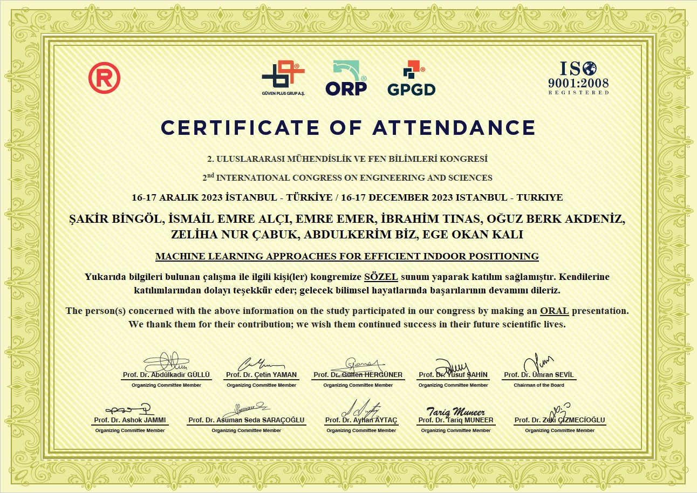

  

# Machine Learning Approaches for Efficient Indoor Positioning: A Comparative Analysis

This repository contains the code and research paper for the project titled **"Machine Learning Approaches for Efficient Indoor Positioning: A Comparative Analysis."** This project implements an Indoor Positioning System (IPS) using various machine learning and deep learning algorithms, including Artificial Neural Network (ANN), Random Forest, K-Nearest Neighbors (KNN), and Support Vector Machine (SVM). The project utilizes the UJIIndoorLoc dataset to evaluate and compare the accuracy of different models for indoor positioning.

## Project Overview
Indoor Positioning Systems (IPS) are crucial for determining the location of people and objects in environments where GPS signals are weak or unavailable, such as multistory buildings, airports, and underground areas. This project leverages machine learning and deep learning models to enhance the accuracy of indoor positioning using Wi-Fi signal strengths. 

## Key Features
- **Machine Learning and Deep Learning Models**: Implements and compares multiple models, including ANN, Random Forest, KNN, and SVM, for indoor positioning tasks.
- **Dataset**: Uses the UJIIndoorLoc dataset, containing Wi-Fi fingerprints collected from multiple buildings and floors.
- **Principal Component Analysis (PCA)**: Applies PCA for dimensionality reduction to improve model efficiency.
- **Performance Metrics**: Evaluates models using metrics like accuracy for building, floor, and relative position prediction.

## Files
- `ANNResults.py`: Implementation of the Artificial Neural Network (ANN) model for indoor positioning.
- `RandomForestResults.py`: Implementation of the Random Forest model for indoor positioning.
- `KNNResults.py`: Implementation of the K-Nearest Neighbors (KNN) model for indoor positioning.
- `SVMResults.py`: Implementation of the Support Vector Machine (SVM) model for indoor positioning.
- `Indoor_Positioning.pdf`: Research paper detailing the implementation, methodology, results, and analysis of the indoor positioning system.

## Methodology
- **Data Processing**: The UJIIndoorLoc dataset contains Wi-Fi signal strengths, building IDs, floor numbers, and relative positions.
- **Model Training**: The dataset is split into training and testing sets. Different models are trained to predict building ID, floor, and relative position based on Wi-Fi signal strengths.
- **PCA for Dimensionality Reduction**: PCA is applied to reduce the dimensionality of the dataset, improving computational efficiency while maintaining accuracy.
- **Model Evaluation**: The accuracy of each model is evaluated for predicting building ID, floor, and relative position.
